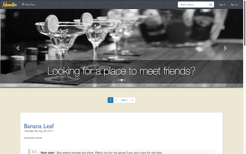

# Nomster

A Yelp style restaurant review application

Check out the live Nomster application [here](https://nomster-ernie-jamison.herokuapp.com) and add a favorite restaurant of yours.

### Features:

* Uses the Google Map API.

* Allows users to add restaurants, upload photos, add comments, and rate restaurants using a 5 star rating system.

* Image storage and delivery utilizes Amazon's S3 Web Services.

* Devise is used for user authentication and sign-in forms.

* Incorporates a simple search feature.

